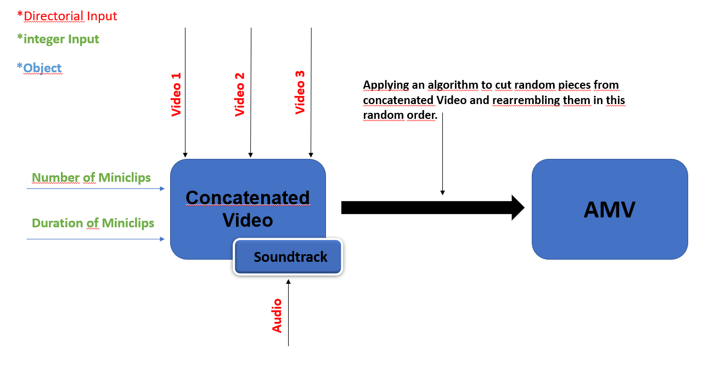
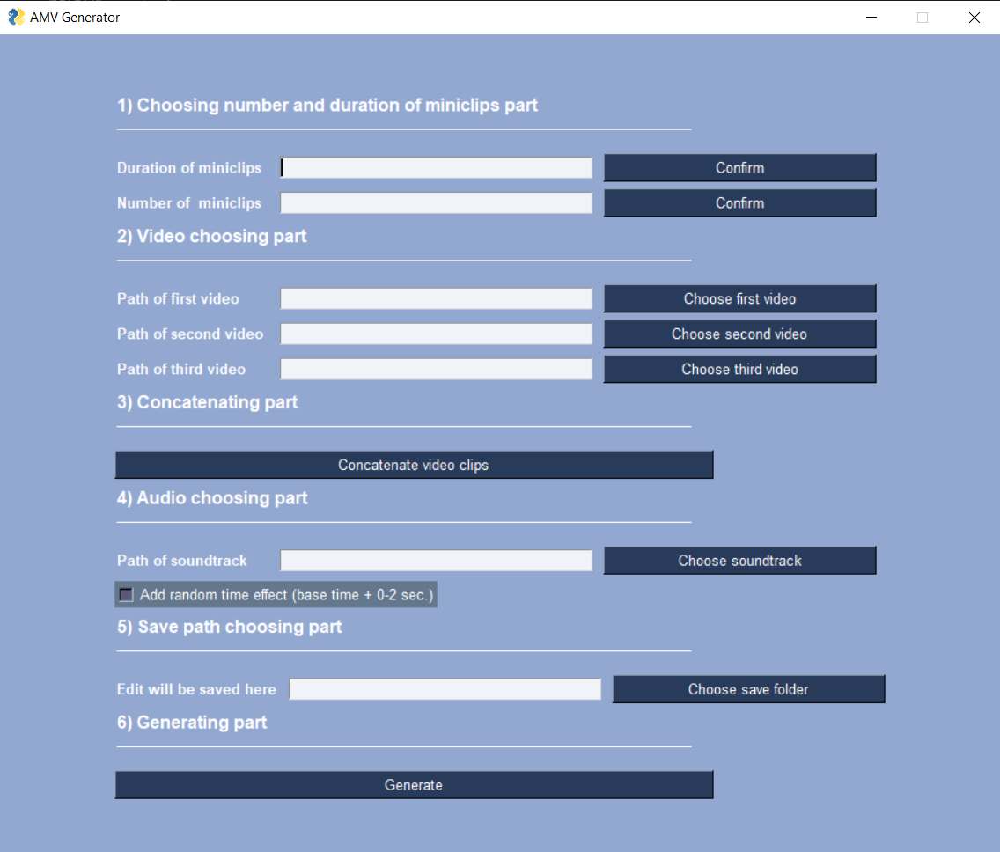

# AMV - Generator

This Application helps you create custom AMV'S with GUI. 

## What is AMV Generator ?

It is a python script with a simple GUI that performs basic editing tasks such as concatenating video files, adding audio files, taking random miniclips and putting them back together in random order.

## Demo

This Demo shows the output (AMV) of the script, which has been fed  with 2 videos from famous anime serie "One Punch Man" and a song named "Phonky Town".

## How it works?

The script takes max. 3 video file paths, one audio path, number of miniclips(mininum) that user wants to produce, lenght of the miniclips(minidur) as input. Then concatenates the video files, adds audio to this new concatenated
video file and applies an algorithm. The algorithm gets random parts from concatenated video clips and saves them to an array as a Moviepy Object without any order. Then reassembles them in this random array order.  The content of the Data in the array depends on two factors, which were defined as mininum and minidur at the beginning.

## Running the Script

The Application has (yet) no executable file, so running it directly from terminal or jupyter notebook is what i would recommend. 

## How to prepare the necessary data?

Since we can supply the script with up to 3 base video clips and one audio file, choosing different sources for videos will be okay. There is also no need to seperate the audios from the base video files, because the script only takes the frames from given videos.
The filetype for the videos are .mp4 and for the audios it is .mp3. So, converting the video and audio files to these format is necessary in order to execute editing tasks.

## GUI Part

 In this project, the GUI enables users to interact with the script freely via different path choosing options, that are capable of getting the required folders from independent paths. The Theme and widgets are the most common used ones from PysimpleGUI Library.
 

## Suggestions

Adding randomness is generally a sub-optimal solution for the problems that requires more data examination. It would be better to analyse certain frames from the video that are compatible
with each other and rearranging then in a more convenient order. Another Suggestion would be taking the audio file variables into account, such as BPM.  

## Conclusion

Although the script is able to generate simple AMV's with short miniclips and small miniclip numbers , it still has some GUI problems, which affects it's performance for longer videos and rendering times.

Created by Can Günen
